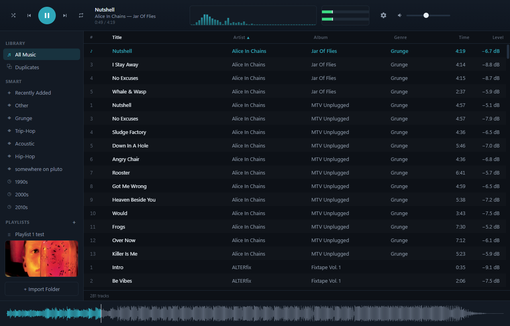
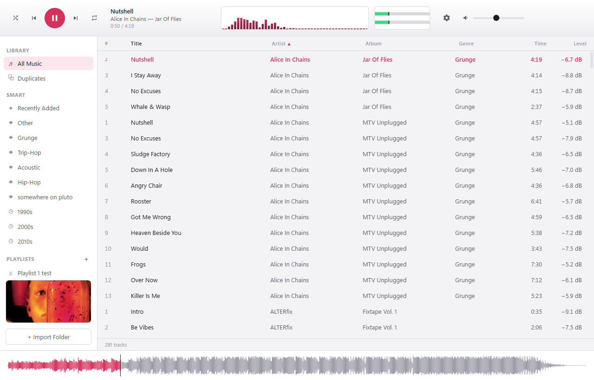
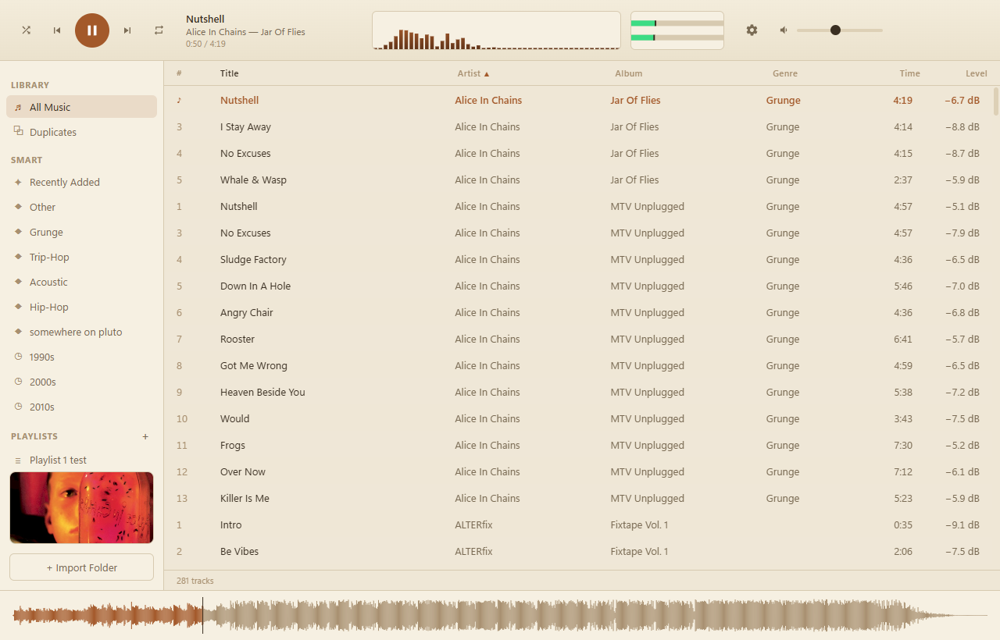

# Doobar 3000

A native Windows music player — simple to use, capable underneath. A fixed, polished
layout out of the box; no panels to assemble. Built with Electron, React, and TypeScript.



## Features

- Plays mp3, flac, m4a, aac, ogg, opus, and wav natively. ALAC, APE, WMA and more via an
  optional one-click ffmpeg decoder pack (transparent transcode + cache).
- LUFS auto-leveling (EBU R128 / ReplayGain 2.0) with Track and Album modes.
- Live log-frequency spectrum analyzer and stereo VU meter, theme-aware.
- Auto-tagging via AcoustID fingerprinting + MusicBrainz, with one-click "apply this match
  to the whole album."
- Automatic cover art from the Cover Art Archive, or set your own from a file.
- Smart playlists derived from your tags: Recently Added, per-genre, per-decade.
- Four themes — Dark, Light, Midnight, Sepia — plus a custom accent color.
- Shuffle and repeat, multi-select, reorderable columns, duplicate detection, waveform seek.

## Themes

| Light | Sepia |
| :---: | :---: |
|  |  |

## Quick start

```
npm install
npm run dev
```

Requires Node.js on Windows.

To enable auto-tagging, paste a free [AcoustID application
key](https://acoustid.org/new-application) into the settings menu. It is stored locally and
never committed.

## Documentation

Build history, architecture notes, and roadmap are in [docs/DEVNOTES.md](docs/DEVNOTES.md).

## License

[MIT](LICENSE) © Stan M
